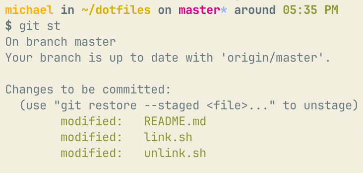

# ··· dotfiles ···

Here are some dotfiles for bash, zsh, git, vim, and more.



## Features

- helpful bash and zsh prompt
- zero dependency bash scripts
- single file symlink setup
- easy to understand and customize
- default vim setup with git subtrees and vim-plug for plugins
- git completions for bash
- custom jupyter notebook css
- aliases like:
  - `git pushme`: pushes current HEAD to remote
  - `git st`: git status
  - `git ds`: diff staged
  - `down`: cd to project root based on .git
  - `back`: cd to last folder
  - `list`: ls everything

## Usage

Clone into `~/dotfiles`.

```bash
$ cd ~
$ git clone https://github.com/themichaelyang/dotfiles
```

Set up symlinks:

```bash
$ cd ~/dotfiles
$ ./link.sh
```

Then restart your terminal. Don't forget to make it your own.

## Customize

`link` tries to symlink files then logs the outcome. That's all you need, really.

Add your own private dotfiles in:
`git/gitprivate` and `shell/bashprivate`. These are included and gitignored by default.

Vim plugins and `vim-plug` are copied as git subtrees in `vim/plugins` to prevent supply chain attacks. 

`git subtree add` to add a plugin, and `git pull` individually to upgrade.

## Uninstall

This script will remove all symlinked dotfiles (".*") in your home directory.
```bash
$ ./unlink.sh
```

It does not remove dotfiles nested in folders yet, a known limitation.

## Links

- https://github.com/paulirish/dotfiles
- https://github.com/mathiasbynens/dotfiles/
